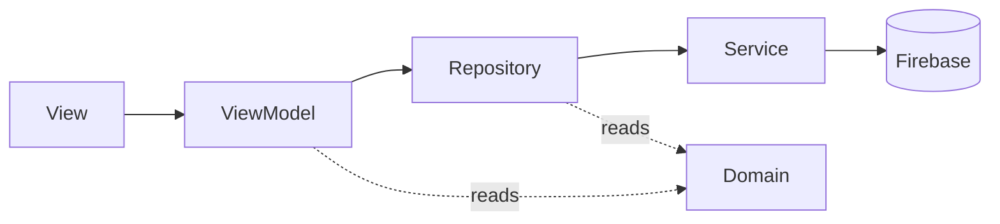

# Architecture

This app follows the official Flutter [app-architecture guidance](https://docs.flutter.dev/app-architecture)
(the "Compass" case study): a layered MVVM design where dependencies point
inward and the UI reaches the backend only through repositories.



## Layers

- **UI** (`lib/ui/`): Views render state and forward user intent to ViewModels.
  ViewModels expose `Command`s and hold no widget references. Shared UI helpers
  live in `ui/core/`.
- **Domain** (`lib/domain/`): backend-agnostic types shared across layers
  (e.g. `AuthFailure`).
- **Data** (`lib/data/`): Repositories expose app-facing operations returning
  `Result` and own their slice of state (e.g. `AuthRepository` is a
  `ChangeNotifier` tracking auth state). Services wrap one backend (Firebase)
  and are the only place that knows about it.
- **Cross-cutting**: `config/` (DI), `routing/`, `l10n/`, `utils/`.

## Directory layout

```
lib/
  config/          dependency wiring (providers)
  routing/         GoRouter config, route constants, authRedirect
  data/
    services/      backend wrappers (AuthService + FirebaseAuthService)
    repositories/  app-facing repositories, grouped by feature
  domain/          shared, backend-agnostic types (AuthFailure)
  ui/
    core/          shared helpers (validators, command feedback, error messages)
    <feature>/     one folder per feature (see below)
  l10n/            ARB files + generated localizations
  utils/           Result, Command
  main.dart
```

### Feature folders (a deliberate variation)

Each feature keeps its screen and view model at the folder root, and reserves
`widgets/` for local sub-widgets:

```
ui/auth/login/
  login_screen.dart      # the screen: feature entry point
  login_viewmodel.dart   # its view model
  widgets/               # local sub-widgets, once a screen needs one
```

This varies from the reference layout, which nests `view_models/` and
`widgets/`. For a project where each feature has a single screen and view model,
a per-type folder holding one file is noise. Keeping the pair adjacent improves
discoverability, mirrors the (already flat) `test/` layout, and gives `widgets/`
a single clear purpose. The convention is applied uniformly across features.

## Building blocks

- **`Result`** (`utils/result.dart`): typed success/error; no throwing across
  layer boundaries.
- **`Command`** (`utils/command.dart`): wraps an async action and exposes
  `running` / `completed` / `error` for the UI to bind loading and feedback to.
- **Dependency injection**: `provider`. The object graph is declared in
  `config/dependencies.dart` and injected at the root in `main.dart`.
- **Routing**: `go_router`. Paths are constants in `routing/routes.dart`. Auth
  gating is the pure, unit-tested `authRedirect(...)`, wired as the router
  `redirect` and driven by `AuthRepository` via `refreshListenable`.
- **Reactive auth state**: `AuthRepository` mirrors Firebase's
  `authStateChanges` stream into a synchronous `isAuthenticated` flag and
  notifies listeners, so navigation reacts to sign-in, sign-out, session
  restore, and token expiry.
- **Error handling**: services map backend exceptions to a domain `AuthFailure`;
  the UI maps `AuthFailure` to a localized message
  (`ui/core/auth_error_messages.dart`). Backend types never reach the UI.
- **Localization**: `gen_l10n` + ARB (`en`, `pt`, `es`, `de`). No user-facing
  string is hardcoded.
- **Design system**: visual components come from the external `rg_design_system`
  package (RG\* widgets and tokens).

## Testing

Tests mirror `lib/` under `test/`, flat per feature. Coverage targets the
testable seams: view models (command outcomes), repositories (against fake
services), the pure `authRedirect`, validators, error mapping, and widget
behavior against fake repositories.
